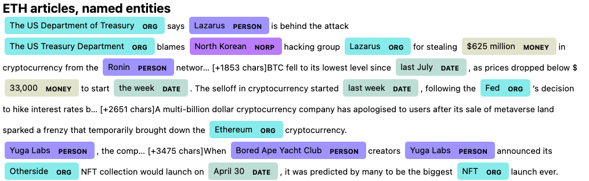

# Fintech--Natural-Language-Processing

The nltk and spaCy python packages have been used to perform text processing and sentiment analysis. Sentiment of Bitcoin and Ethereuem was analysd from the 100 most relevant news articles as of 2022-05-13. 

---
## Comparing BTC and ETH sentiment.
nltk's vader analyser has been used to calculate sentiment scores for each article in the dataset, comparion of the statistical values across all articles revealed that ethereum had an overall higher sentiment score across each of the sentiment metrics.

Ethereum has a better general sentiment as it scores higher in positive sentiment and is approximatly equal in neutral and negative sentiment.

---
## Frequecny analysis and word clouds

The WordCloud library was used to generate word clouds from a concatenated list of all articles for each cryptocurrency. The word 'chars' was added to the stopwords as it was present in all articles and did not provide any meaningful insight on the wordclouds.

---

## Named entitiy recognition

The spaCy library was used to generate contextual analysis and extract named entities from the text. 

